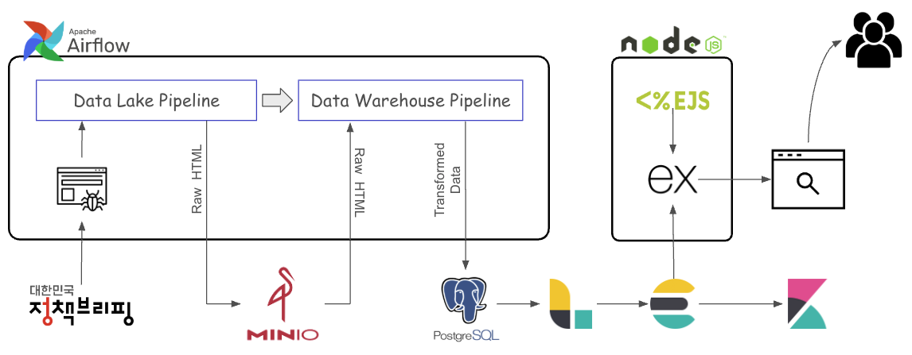
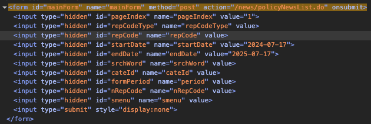
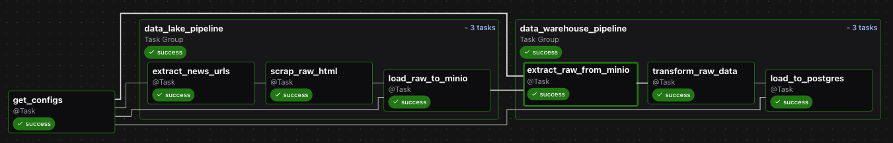

# Korea Policy News Crawler

이 프로젝트는 대한민국 정책 브리핑 웹사이트(http://www.korea.kr/)의 뉴스 기사를 자동으로 수집하고 정제하여, Elasticsearch 기반의 검색 가능한 웹 애플리케이션으로 제공하는 데이터 파이프라인 및 검색 엔진 구축 프로젝트입니다.

---

- 프로젝트 기간: 25.07.12 ~ 25.07.18 (7일)
- 프로젝트 인원: 1인

# 사용 기술 스택

- **웹 크롤링** - Python, httpx, beautifulsoup, lxml, pydantic, mypy, ruff
- **데이터 저장소** - MinIO, PostgreSQL
- **워크플로우 오케스트레이션** - Apache Airflow 3.0.3
- **인프라 및 배포** - Docker, Docker Compose
- **웹 애플리케이션** - Node.js, TypeScript, Express, EJS, Biome

# 아키텍처

- Apache Airflow가 데이터 레이크 파이프라인과 데이터 웨어하우스 파이프라인 두 가지 워크플로우를 스케줄링하여 정책브리핑 사이트의 뉴스를 수집하고 정제합니다.
- 수집된 Raw HTML 데이터는 Object Storage인 MinIO에 저장되고 (데이터 레이크 역할), 정제된 구조화 데이터는 PostgreSQL 데이터베이스(데이터 웨어하우스 역할)에 적재됩니다.
- Logstash가 PostgreSQL에서 정제된 데이터를 주기적으로 가져와 Elasticsearch에 인덱싱하며, Kibana를 통해 인덱싱된 데이터를 시각화하고 모니터링할 수 있습니다.
- 최종적으로 Node.js/Express 기반의 웹 애플리케이션이 Elasticsearch에 질의하여 사용자에게 뉴스 검색 결과를 실시간으로 제공하게 됩니다.



# 실행 방법

### 1. 프로젝트 클론

```bash
git clone [YOUR_REPOSITORY_URL]
cd korea-policy-news-crawler
```

### 2. 환경 변수 설정

```bash
# .example.env 파일 이름 변경
mv .example.env .env

# AIRFLOW_FERNET_KEY 생성
# FERNET_KEY 생성을 위해 cryptography 라이브러리가 필요합니다. 먼저 설치합니다.
pip install cryptography

# 다음 명령어를 실행하여 키를 생성하고 복사합니다.
python -c "from cryptography.fernet import Fernet; print(Fernet.generate_key().decode())"

# 생성된 `AIRFLOW_FERNET_KEY`를
# .env 파일 내 YOUR_FERNET_KEY 플레이스홀더 대신 붙여넣습니다.

# AIRFLOW_UID는 필요시 수정합니다.
```

### 3. Docker Compose로 서비스 시작

```bash
# 모든 서비스 빌드 및 백그라운드 실행
docker compose up -d --build

# 모든 컨테이너가 정상적으로 실행되었는지 확인
docker compose ps
```

### 4. Airflow DAG 실행

- **Airflow UI 접속**: `http://localhost:8080`
  (기본 사용자명: `airflow`, 비밀번호: `airflow`)
- `korea_policy_news_crawling_pipeline` DAG을 활성화하고 수동으로 실행합니다.
  DAG 실행이 성공적으로 완료될 때까지 모니터링합니다.

### 5. 웹 애플리케이션 확인

- **웹 애플리케이션 접속**: `http://localhost:3000`
- 검색 기능을 사용하여 Elasticsearch에 적재된 뉴스 데이터를 확인합니다.

### 6. Kibana에서 데이터 확인 (선택 사항)

- **Kibana UI 접속**: `http://localhost:5601`
- `korea-policy-news-*` 인덱스 패턴으로 Data View를 생성하고, Discover 탭에서 데이터를 탐색합니다.

# 주요 구현 부분

## Web Crawling

- 웹 크롤링은 **뉴스 URL 리스트 수집 → 각 뉴스 웹 페이지의 Raw HTML 수집** 단계로 이루어집니다. 구체적인 구현 내용은 아래와 같습니다.
- **웹 사이트 분석**
  웹 사이트를 분석한 결과, 뉴스 리스트의 페이지네이션에 따라 URL이 변경되지 않는 것을 확인하였습니다. 정적 분석을 통해 Form Submit 방식의 API 호출을 통해 뉴스 리스트가 반환되는 구조임을 파악하였고, 이에 따라 필요한 파라미터를 구성하여 직접 API를 호출하는 방식으로 구현하였습니다.
  이를 통해 Selenium 혹은 Playwrights와 같은 브라우저 자동화 도구를 사용하는 것보다 효율적이고, 안정적인 크롤링이 가능하도록 하였습니다.
  
- **비동기 Batch 처리**
  수집된 뉴스 URL 리스트를 기반으로 각 뉴스의 Raw HTML을 수집합니다. 수집 속도를 높이기 위해 asyncio를 활용하여 일정 개수씩 나누어 병렬로 요청하는 비동기 Batch 처리 방식을 적용하였습니다.
- **Rate Limiting (요청 속도 제어)**
  웹 서버에 과도한 부하를 주지 않기 위해, 각 Batch 처리 사이에 일정 간격을 두는 요청 속도 제어(Rate Limiting) 전략을 적용하였습니다. 이는 서버 차단 위험을 줄이고, 보다 안정적이고 지속적인 수집이 가능하도록 하였습니다.
- **요청 헤더 최적화**
  크롤링 과정에서 웹 서버의 탐지를 회피하고, 요청의 효율성을 높이며, 실제 브라우저와 유사한 접근을 시뮬레이션하기 위해 다양한 HTTP 헤더 관리 전략을 적용하였습니다.
  - **User-Agent Rotation (사용자 에이전트 로테이션)**
    미리 정의된 다양한 User-Agent 목록 중에서 요청 시마다 무작위로 하나를 선택하여 사용합니다. 이는 단일 User-Agent 반복 사용으로 인해 비정상적인 접근으로 인식되는 것을 방지하고, 크롤링의 안정성과 지속 가능성을 높이는 데 기여합니다.
  - **Default Domain Referer (기본 도메인 리퍼러)**
    요청의 Referer 헤더를 대상 웹사이트의 기본 도메인으로 설정하여, 마치 사용자가 웹사이트 내부에서 자연스럽게 페이지를 이동한 것처럼 보이게 만듭니다. 이를 통해 요청의 정당성을 높이고 차단 위험을 줄일 수 있습니다.
  - **Optimize Accept-_ Headers (Accept-_ 헤더 최적화)**
    Accept, Accept-Language, Accept-Encoding 등의 헤더 값을 실제 브라우저가 전송하는 값과 유사하게 설정합니다. 서버가 클라이언트의 선호도를 바탕으로 최적화된 응답(예: 압축된 콘텐츠, 한국어 페이지)을 제공하도록 유도하며, 봇 탐지 회피에도 효과적입니다.
  - **Connection Keep-Alive (연결 유지)**
    `Connection: keep-alive` 헤더를 사용하여 한 번 수립된 TCP 연결을 다음 요청에도 재사용하도록 합니다. 이는 매 요청마다 새로운 연결을 수립하는 오버헤드를 줄이고, 크롤링 속도 및 성능을 향상시키는 데 도움이 됩니다.

## Data Lake

- Data Lake 단계는 웹 크롤링을 통해 수집된 각 뉴스 웹 페이지의 Raw HTML을 원본 그대로 저장하는 역할을 합니다. 이는 데이터의 무결성을 보존하고, 향후 데이터 모델 변경이나 재처리가 필요한 경우, 원본 데이터를 기반으로 유연하게 대응할 수 있도록 하기 위함입니다.
- **MinIO 활용**
  S3 호환 객체 스토리지인 MinIO를 활용하여 Data Lake를 구축하였습니다. MinIO는 Docker Compose를 통해 간편하게 배포 및 관리할 수 있으며, S3 API와의 호환성을 제공하여 다양한 도구들과의 연동이 용이합니다.
  또한, 대량의 비정형 또는 반정형 데이터를 저장하는 데 적합하며, 필요에 따라 유연하게 확장이 가능하고, 자체 호스팅을 통해 비용 효율성도 확보할 수 있습니다.
- **객체 명명 규칙**
  각 HTML 객체는 `YYYY/MM/DD/<news_id>.html` 형식의 계층적 구조로 저장되어, 관리와 검색의 효율성을 높였습니다.
- **메타데이터 포함**
  각 객체에는 크롤링 시각(`crawled_at`) 등의 메타데이터도 함께 저장하여, 데이터의 출처 및 수집 시점에 대한 정보를 추적할 수 있도록 하였습니다.

## Data Warehouse

- Data Warehouse 단계는 Data Lake에 저장된 Raw 데이터를 읽어와 구조화된 형태로 변환하고 저장하는 역할을 합니다. 이는 분석 및 활용 목적에 맞는 정제된 데이터를 제공하고, 데이터의 정합성을 확보하기 위함입니다.
- **PostgreSQL 활용**
  관계형 데이터베이스인 PostgreSQL을 Data Warehouse로 사용하였습니다. PostgreSQL은 데이터의 정합성과 트랜잭션 처리에 강점을 가지며, 다양한 BI 도구 및 애플리케이션과의 연동이 용이합니다. 또한, 안정적인 데이터 저장소로서 파이프라인의 핵심적인 역할을 수행합니다.
- **데이터 변환 및 스키마 설계**
  Airflow DAG의 “Data Warehouse Pipeline” 내 `transform_raw_data` 태스크를 통해 MinIO에 저장된 Raw HTML을 불러옵니다. 이후 `plugins/crawler/scrap_news.py` 모듈을 활용하여 뉴스 데이터를 구조화된 형태로 파싱 및 변환합니다.
  이 과정에서 뉴스 ID, 제목, 본문, 발행처, 발행일 등의 핵심 정보를 추출하며, 이미지 정보는 `images` 필드에 `{ "url": "...", "alt": "..." }` 형식의 JSONB 배열로 저장하여 유연한 확장을 가능하게 하였습니다.
  `news` 테이블의 스키마는 다음과 같습니다.
  | 필드명 | 자료형 | 제약 조건 | 설명 |
  | -------------- | -------------------------- | ------------- | ----------------------------------- |
  | `id` | `BIGINT` | `PRIMARY KEY` | 뉴스 고유 ID |
  | `title` | `TEXT` | `NOT NULL` | 뉴스 제목 |
  | `subtitles` | `TEXT[]` | | 뉴스 부제목 (복수 가능) |
  | `publisher` | `TEXT` | | 발행처 |
  | `contents` | `TEXT` | `NOT NULL` | 뉴스 본문 내용 |
  | `images` | `JSONB[]` | | 이미지 정보 배열 (URL 및 설명 포함) |
  | `url` | `TEXT` | `NOT NULL` | 원본 뉴스 URL |
  | `published_at` | `TIMESTAMP WITH TIME ZONE` | `NOT NULL` | 뉴스 발행일시 |
  | `crawled_at` | `TIMESTAMP WITH TIME ZONE` | `NOT NULL` | 뉴스 크롤링 일시 |
- **Upsert 로직**
  `load_to_postgres` 태스크를 통해 변환된 데이터를 PostgreSQL의 `news` 테이블에 적재합니다. 이 과정에서 `ON CONFLICT (id) DO UPDATE SET ...` 구문을 사용한 Upsert 로직을 통해 이미 존재하는 뉴스는 업데이트하고, 새로운 뉴스는 삽입함으로써 중복 없이 최신 상태를 유지합니다.
- **데이터 활용**
  PostgreSQL에 적재된 정제된 뉴스 데이터는 Logstash의 JDBC Input Plugin을 통해 주기적으로 읽혀져 Elasticsearch로 인덱싱됩니다.
  최종적으로 이 데이터는 웹 애플리케이션의 뉴스 검색 기능의 소스로 활용됩니다.

## Workflow Orchestration

- **Apache Airflow 활용**
  데이터 파이프라인은 여러 단계로 구성되며, 이를 정의하고 스케줄링, 모니터링, 오류 처리까지 자동화하기 위해 워크플로우 오케스트레이션 도구를 활용하였습니다.
  그중에서도 본 프로젝트에서는 Apache Airflow 3.0을 선정하여 적용하였습니다.
- **TaskFlow API 활용**
  각 파이프라인 단계는 TaskFlow API를 통해 Python 함수에 `@task` 데코레이터를 적용하여 정의하였습니다.
  이 방식은 코드의 가독성과 재사용성을 높여주며, XCom을 통한 태스크 간 데이터 전달도 자동으로 처리되어 개발 편의성이 좋았습니다.
- **Task Group 활용**
  관련된 태스크들을 논리적 단위로 그룹화하기 위해 Task Group 기능을 활용하여 워크플로우를 구조화하였습니다.
  - **Data Lake Pipeline Group**: 뉴스 URL 수집, Raw HTML 수집, MinIO 저장 등 원시 데이터 수집 및 저장 단계
  - **Data Warehouse Pipeline Group**: Raw HTML 처리, 데이터 정제, PostgreSQL 저장 등 데이터 구조화 및 적재 단계
    이처럼 그룹화된 구조는 Airflow UI 상에서 전체 파이프라의 흐름을 시각화할 수 있게 해주며, 각 태스크의 성공/실패 여부를 직관적으로 확인할 수 있도록 해줍니다.
    

## Web Application

- **웹 인터페이스 역할**
  Web Application은 구축된 데이터 파이프라인의 최종 결과물을 사용자에게 제공하는 인터페이스 역할을 수행합니다. 사용자는 웹 애플리케이션을 통해 Elasticsearch에 인덱싱된 뉴스 데이터를 검색하고 탐색할 수 있습니다.
- **Node.js + Express + EJS + TS**
  웹 애플리케이션은 Node.js 런타임 환경에서 Express.js 프레임워크를 기반으로 백엔드를 구현하였습니다. 프론트엔드는 EJS(Embedded JavaScript) 템플릿 엔진을 활용하여 서버 사이드 렌더링 방식으로 구성하였으며, Elasticsearch와의 통신은 공식 JavaScript 클라이언트인 @elastic/elasticsearch 라이브러리를 통해 처리하였습니다.

# 향후 개선 계획

- **크롤링 대상 확대**
  현재는 정책브리핑 사이트(korea.kr)의 정책 뉴스에 한정되어 있지만, 향후에는 정부 부처별 보도자료나 기타 공공기관 뉴스, 혹은 관련 언론사의 기사까지 크롤링 대상을 늘려 데이터의 다양성을 확보할 계획입니다.
- **데이터 정제 및 NLP 고도화**
  뉴스 본문으로부터 키워드 추출, 개체명 인식(NER), 감성 분석 등의 자연어 처리 기법을 도입하여 부가 정보를 생성하고, 사용자에게 더 유용한 검색 필터나 요약 정보를 제공하도록 발전시킬 것입니다. 또한 불필요한 HTML 태그 제거 등 정제 로직을 더욱 견고히 다듬을 예정입니다.
- **검색 기능 강화**
  Elasticsearch의 퍼지 검색, 동의어 사전 등을 활용하여 오타가 있는 경우에도 검색이 되거나 관련어로도 검색될 수 있도록 기능을 향상시킬 것입니다. 또한 검색 결과에 하이라이팅(검색어 강조) 기능을 추가하여 사용자가 결과 내에서 키워드를 쉽게 식별할 수 있도록 할 예정입니다.
- **CI/CD 파이프라인 구축**
  현재 수동으로 수행되는 배포 과정을 자동화하기 위해 GitHub Actions 혹은 Jenkins 기반의 CI/CD 파이프라인을 구축할 계획입니다. 코드 푸시 시 자동으로 테스트와 빌드, Docker 이미지 생성 및 배포까지 이어지도록 하여 개발 효율성과 배포 안정성을 높이고자 합니다.
- **모니터링 및 알림 시스템**
  시스템이 운영되는 동안 크롤링이나 인덱싱 작업이 실패하거나 지연되는 경우를 대비해 모니터링을 강화할 예정입니다. Prometheus 및 Grafana를 도입하여 파이프라인 성능 지표(예: 크롤링 속도, 인덱싱 문서 수 등)를 모니터링하고, 중요한 이벤트 발생 시 Slack이나 이메일로 실시간 알림을 받을 수 있도록 할 계획입니다.
- **웹 애플리케이션 UI/UX 개선**
  현재의 서버사이드 렌더링 기반 UI를 React나 Vue.js 등의 모던 프론트엔드 프레임워크로 재구현하는 것을 검토하고 있습니다. 이를 통해 보다 역동적인 사용자 경험을 제공하고, 필요시 사용자 리뷰나 북마크, 즐겨찾기 등 추가 기능도 쉽게 확장할 수 있을 것입니다. 디자인 측면에서도 최신 트렌드를 반영하고 반응형 UI를 더욱 최적화할 계획입니다.
